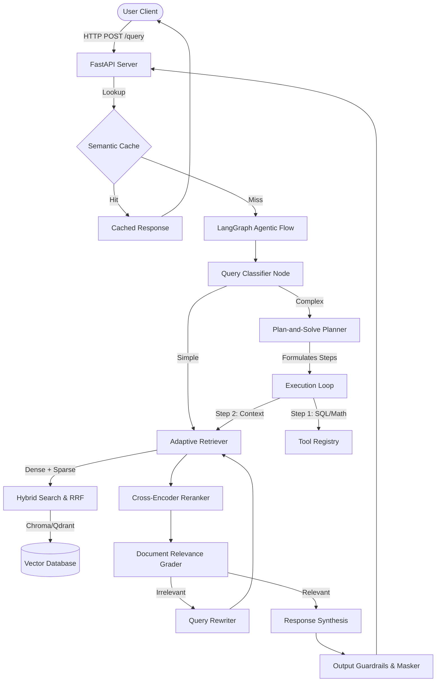

# Aegis RAG — Production-Grade Autonomous Retrieval Engine

Aegis RAG is a production-ready, highly reliable, and multi-tenant Retrieval-Augmented Generation (RAG) system. It combines the structured workflow of **LangGraph**, the retrieval index efficiency of **LlamaIndex**, and the model reasoning capabilities of **Google Gemini** into a unified cognitive engine.



---

## 🎯 Key Capabilities

- **Adaptive Semantic Retrieval**: Dynamically routes requests between instant cache matching, standard document retrieval, and complex agentic tool usage based on classification.
- **Plan-and-Solve Reasoning Loop**: Solves multi-layered questions by generating an execution plan, utilizing specific database and calculations tools, and merging insights dynamically.
- **Advanced Dense-Sparse Hybrid Search**: Merges vector database query results (Chroma/Qdrant) and BM25 sparse lexical search scores using Reciprocal Rank Fusion (RRF) and Cross-Encoder reranking.
- **Enterprise Hardening**:
  - **Multi-Tenant Isolation**: Cryptographically secure resource separation with API key authorization.
  - **Rate Limiting**: Configurable token bucket rate limiting on request volume.
  - **Guardrails**: Integrated PII masking, query filters, and hallucination checks.
  - **Observability**: Direct OpenTelemetry metrics exporter integration and LangSmith tracing.
- **Modern Web Portal**: A next-generation Next.js client interface styled with a bespoke, warm-charcoal and gold color scheme (no generic neon vibe-coded themes).

---

## 🏗️ Project Structure

```
RAG-Prod-Level/
├── src/
│   ├── api/             # FastAPI REST endpoints & observability
│   ├── cache/           # Semantic SQLite & Redis caches
│   ├── config/          # Central settings & Pydantic config
│   ├── db/              # Vector database layers (Qdrant & Chroma)
│   ├── graph/           # LangGraph Agent nodes & workflow state
│   ├── ingestion/       # CDC synchronizer & document parsers
│   ├── llamaindex/      # LlamaIndex query engine & router wrappers
│   ├── llm/             # Gemini API client interface
│   ├── processing/      # Chunking pipeline & embedding models
│   ├── retrieval/       # Parent retriever & BM25 / Rerank modules
│   ├── tenants/         # Multi-tenant resource managers
│   └── tools/           # Calculator, Web Search & database tools
├── frontend/            # Next.js web application
│   ├── src/app/         # Next.js page routing & components
│   └── package.json     # Node.js configurations
├── data/                # Ingestion source files & storage
├── tests/               # Pytest verification suites
├── main.py              # System entry check script
└── requirements.txt     # Python backend dependencies
```

---

## 🚀 Installation & Running

### Prerequisites
- Python 3.10+
- Node.js 18+ & npm 9+
- Google Gemini API key

### 1. Backend Server Setup
1. Create and activate a Python virtual environment:
   ```bash
   python -m venv myenv
   source myenv/bin/activate  # Linux/Mac
   # or myenv\Scripts\activate on Windows
   ```
2. Install Python dependencies:
   ```bash
   pip install -r requirements.txt
   ```
3. Set up your `.env` configuration file:
   ```bash
   cp .env.example .env
   # Edit .env with your GEMINI_API_KEY and custom database settings
   ```
4. Start the FastAPI backend:
   ```bash
   python scripts/run_server.py
   ```
   *The API documentation is now accessible at `http://localhost:8000/docs`.*

### 2. Frontend Interface Setup
1. Navigate to the frontend directory:
   ```bash
   cd frontend
   ```
2. Install dependencies:
   ```bash
   npm install
   ```
3. Run the development server:
   ```bash
   npm run dev
   ```
   *Open `http://localhost:3000` to interact with the visual portal.*

### 3. Docker Compose Orchestration (Recommended)
You can build and spin up both services with a single command:
1. Ensure your `.env` file exists in the root directory and has your `GEMINI_API_KEY` filled.
2. Build and launch the containers:
   ```bash
   docker-compose up --build
   ```
3. Access the services:
   - **Aegis Frontend UI**: http://localhost:3000
   - **FastAPI Documentation**: http://localhost:8000/docs

---

## 🧪 Testing
The python backend includes a complete integration test suite ensuring correct state graph execution, guardrails validation, and cache management:
```bash
pytest tests/
```
